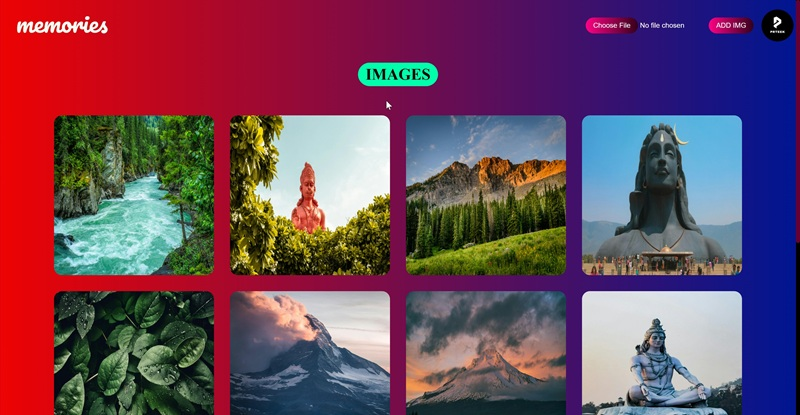

# Image Gallery Project

## 📌 Overview
This is a **responsive image gallery** project designed to provide a smooth and engaging user experience. The gallery allows users to **click on any image to view it in an overlay modal**, making it easier to focus on details without navigating away from the page.  
It’s built using **HTML, CSS, and JavaScript**, and can be customized with your own images, styles, and animations.

---

## ✨ Features
- **Responsive Layout**: Works on all screen sizes.
- **Overlay Image Viewer**: Click an image to view it in a full-screen overlay.
- **Smooth Transitions**: Elegant animations when opening and closing the overlay.
- **Customizable**: Easily replace images and change styles.
- **Keyboard Navigation**: Close the overlay using the `Esc` key.

---

## 🛠️ Technologies Used
- **HTML5** for structure
- **CSS3** for styling and layout
- **JavaScript (Vanilla JS)** for interactivity

---

## 📂 Folder Structure
- project-folder/
- │── index.html
- │── main.css
- │── main.js
- │── assets/
- │ ├── img1.jpg
- │ ├── img2.jpg
- │ └── ...

## 🚀 Live Demo
[Click here to try the website](https://memories-prteek.netlify.app/)  

---

## 📷 Screenshot

)  
